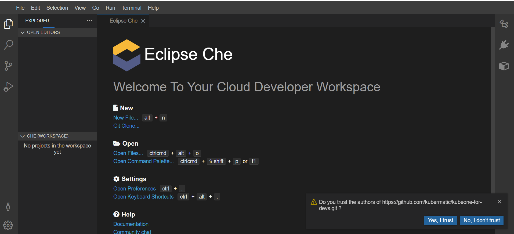
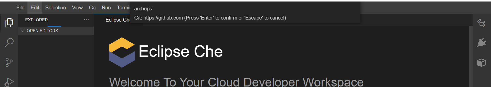
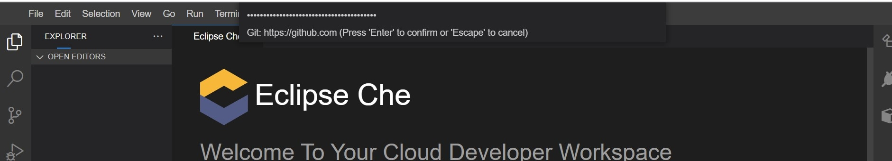

# che-workspace
Repository to manage user guide and customizations for Che Workspace.


## Create CHE Workspace from the remote devfile using the dashboard

Here we are using Factory loader approach to create your initial workspace using below URL.
https://$CHE_HOST/dashboard/#https://github.com/kubermatic/kubeone-for-devs.git

For example, if the $CHE_HOST is che.example.com, then use below URL to create your workspace
https://che.example.com/dashboard/#https://github.com/kubermatic/kubeone-for-devs.git

For more information, checkout the official [Eclipse CHE Create Workspace](https://www.eclipse.org/che/docs/che-7/end-user-guide/creating-a-workspace-from-remote-devfile/) docs.


## Adding remote Git repositories to your existing CHE Workpsace
Login to the dashboard using https://$CHE_HOST/dashboard/ and click on the Workspaces tab.

Click the appropiate workspace > Devfile. 

Under the projects section in the devfile, add list of the git repositories you want to import to your workspace.

Following block reference to show projects section in the devfile.
```yaml
projects:
  - git:
      remotes:
        origin: 'https://github.com/archups/che-workspace.git'
    name: che-workspace
  - git:
      remotes:
        origin: 'https://github.com/<org-name>/<your-repo-name>.git'
    name: <your-repo-name>
```


## Update your GitHub credentials in the Workspace to clone private Git repository
* For the first time you open your CHE workspace, at the right bottom of the workspace you get this prompt .. Accept it, by clicking on option --> Yes, I trust


* Provide your GitHub username and hit enter button.


* Provide your valid GitHub personal access token as password and hit enter button.

  > Create personal access token if you don't have one, follow instruction [here](https://docs.github.com/en/authentication/keeping-your-account-and-data-secure/creating-a-personal-access-token).